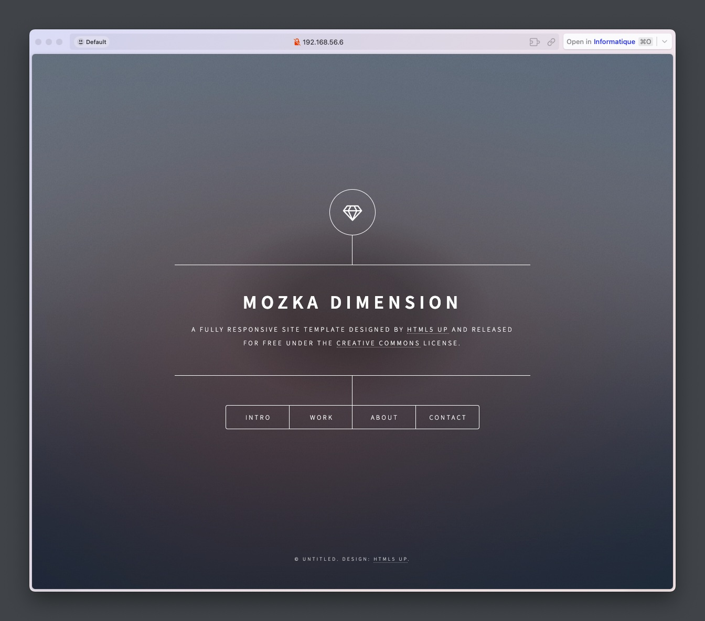

## Module Docker · TP4

Ce TP est en 2 partie. Il consiste à créer deux volumes (*bind mount et volumes*) Docker puis d'y rattacher des conteneurs. Pour faciliter le processus j'ai mis en place 2 scripts pour chaque parties.

Je vais tout de même indiquer les étapes ci-dessous.

### Partie 1 - Volumes nommés

Cette 1ere partie consiste à monter un volume de type **Volumes** sur un de nos conteneurs puis de vérifier que le fichier est bien présent sur l'autre conteneur. Comme indiqué plus haut j'ai mis en place un script qui déploie toutes les commandes, il suffira juste de se connecter au conteneur 2 et vérifier que le fichier est bien présent.

#### Étape 1 : Création du volume de type *Volumes*

Avec la commande suivante:

`docker volume create --name nas`

#### Étape 2 : Création et rattachement de deux containers au volume nas

Avec les commandes suivante:

`docker run -it --name ubuntu1 -v nas:/tmp -d ubuntu /bin/bash`

`docker run -it --name ubuntu2 -v nas:/tmp -d ubuntu /bin/bash`

#### Étape 3 : Création du fichier à l'intérieur du point de montage

On se connecte d'abord au conteneur:

`docker exec -it ubuntu1 /bin/bash`

On crée le fichier texte dans **/tmp**:

`touch /tmp/mozkagit.txt`

Profitons-en pour écrire à l'intérieur du fichier:

`echo "MozkaGit, membre de la 13e promo du bootcamp Eazytraining." > /tmp/mozkagit.txt`

#### Étape 4 : Vérification de la présence du fichier

On se connecte au second conteneur:

`docker exec -it ubuntu2 /bin/bash`

On vérifie la présence du fichier **mozkagit.txt**:

`cat /tmp/mozkagit.txt`

Voici le résultat que l'on devrait avoir:

```
root@35fe165d96b7:/# cat /tmp/mozkagit.txt
MozkaGit, membre de la 13e promo du bootcamp Eazytraining.
```
---

### Partie 2 - Bind mount

Cette 2nd partie consiste à monter un volume de type **bind mount** sur notre conteneur serveur web puis de modifier le fichier directement depuis le système hôte. Comme indiqué plus haut j'ai mis en place un script qui déploie toutes les commandes, il suffira juste de faire les vérifications et modifications manuellement.

#### Étape 1 : Clone du repo static-website-example

Avec la commande suivante:

`git clone https://github.com/diranetafen/static-website-example.git`

#### Étape 2 : Création et rattachement du volume au conteneur

Avec la commande suivante:

`docker run --name webserver -p 80:80 -d -v ${PWD}/static-website-example:/usr/local/apache2/htdocs/ httpd`

On peut vérifier si le contenu de static-website-example est bien présent dans le répertoire apache2 du conteneur.

Avec les commandes suivantes:

`docker exec -it webserver /bin/bash`

`ls /usr/local/apache2/htdocs` 

Le résultat :

```
root@a1aa645da3ed:~# ls /usr/local/apache2/htdocs
LICENSE.MD  README.MD  assets  error  images  index.html
```

Maintenant qu'on a bien vérifié que le répertoire **static-website-example** situé dans le répertoire courant `${PWD}` est correctement monté dans le répertoire par défaut Apache2 on peut se déconnecter du conteneur.

#### Étape 3 : Modification de index.html

Après avoir vérifié que le serveur web est bien actif, effectuons une modification de `static-website-example/index.html` **depuis le système hôte** pour vérifier que le bind mount fonctionne correctement.

Avec la commande suivante:

`vi static-website-example/index.html`

Chercher et modifier la ligne `<h1>Dimension</h1>` --> `<h1>Mozka Dimension</h1>`

On redémarre le serveur:

`docker restart webserver`

#### Étape 4 : Vérification de la modification



La mention *Mozka* a bien été ajoutée devant *Dimension*.

---

Précision

Pour la partie 1, notez que même si le conteneur est supprimé accidentellement, les données restent accessibles après sa recréation grâce au caractère persistant du volume.